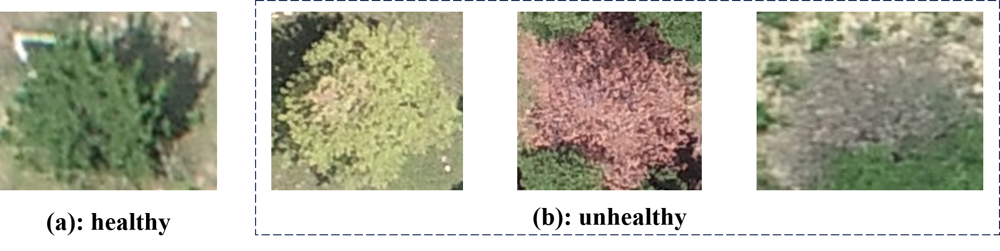
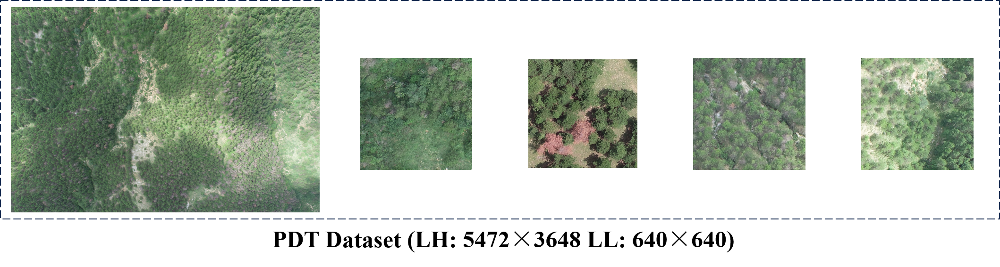
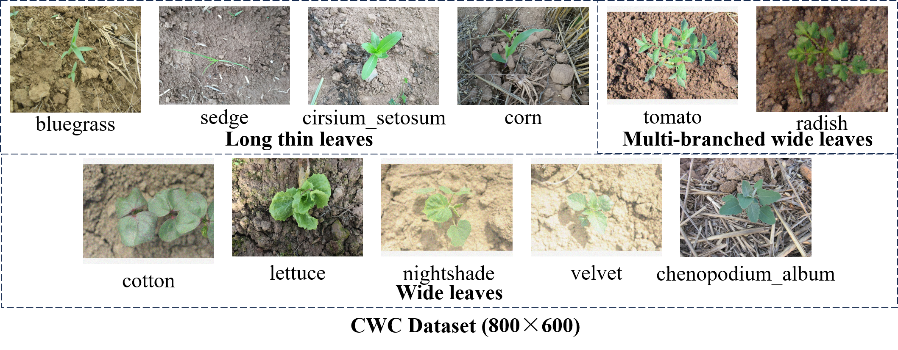
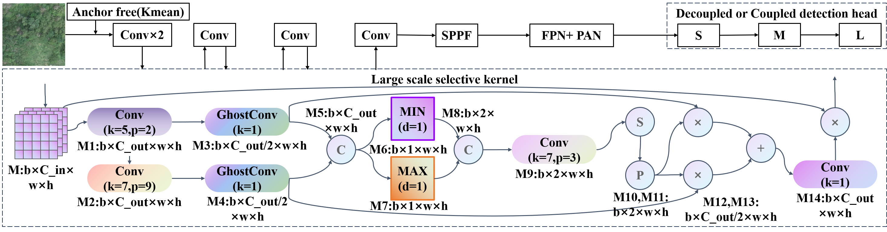
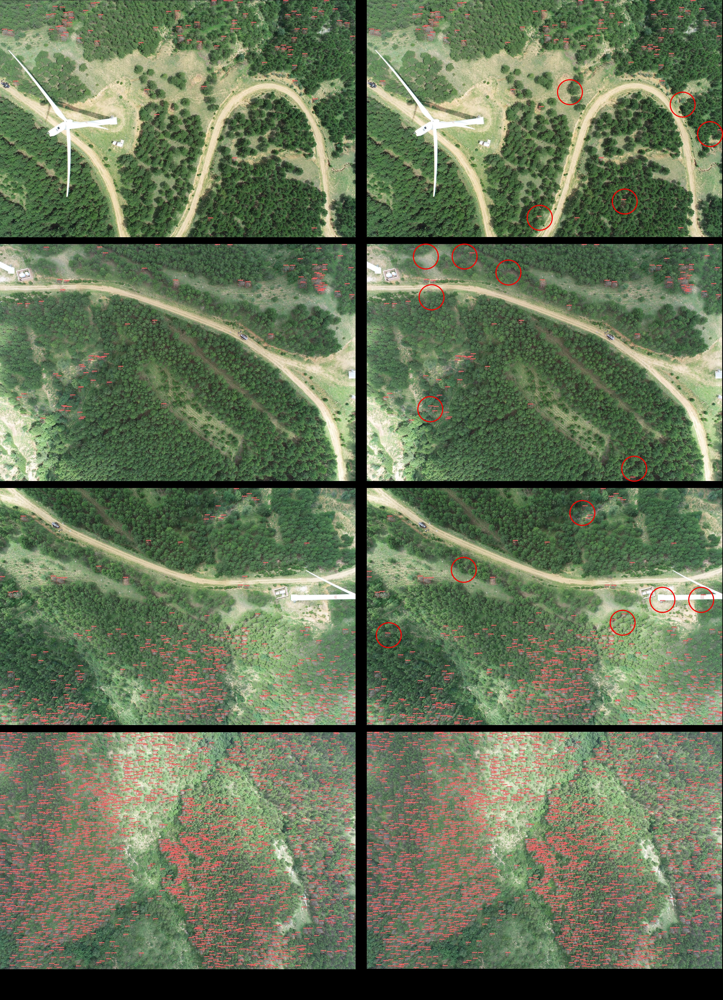
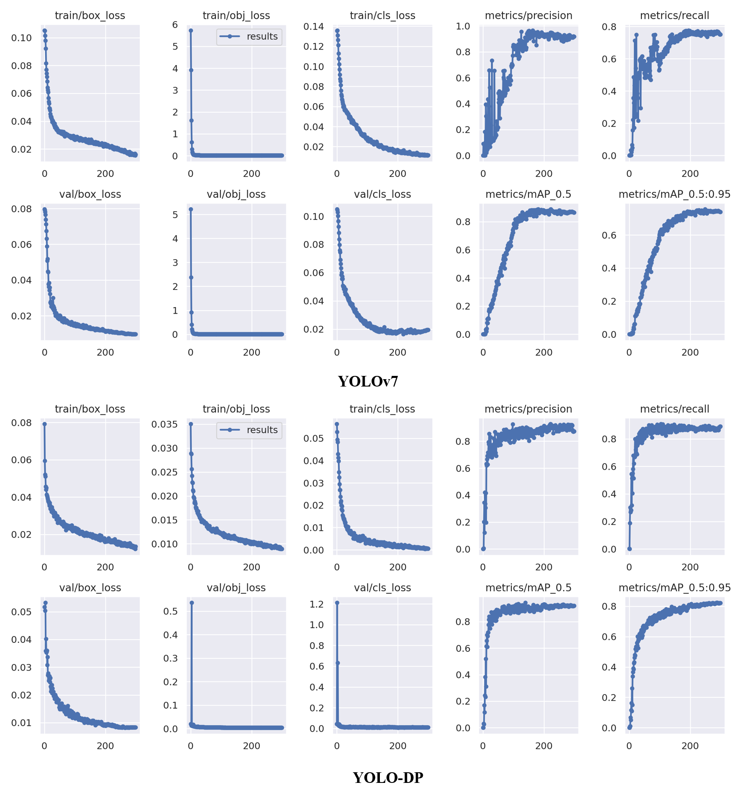

# 
PDT: Uav Target Detection Dataset for Pests and Diseases Tree

## Abstract

  UAVs emerge as the optimal carriers for visual weed identification and integrated pest and disease management in crops. However, the absence of specialized datasets impedes the advancement of model development in this domain.
  To address this, we have developed the Pests and Diseases Tree dataset (PDT dataset). PDT dataset represents the first high-precision UAV-based dataset for targeted detection of tree pests and diseases, which is collected in real-world operational environments and aims to fill the gap in available datasets for this field.
  Moreover, by aggregating public datasets and network data, we further introduced the Common Weed and Crop dataset (CWC dataset) to address the challenge of inadequate classification capabilities of test models within datasets for this field.
  Finally, we propose the YOLO-Dense Pest (YOLO-DP) model for high-precision object detection of weed, pest, and disease crop images.  We re-evaluate the state-of-the-art detection models with our proposed PDT dataset and CWC dataset, showing the completeness of the dataset and the effectiveness of the YOLO-DP.
## Download Dataset

  **Hugging Face:** [PDT dataset](https://huggingface.co/datasets/qwer0213/PDT_dataset/tree/main), [CWC dataset](https://huggingface.co/datasets/qwer0213/CWC_dataset/tree/main)
## Code

  **GitHub:** [YOLO-DP Model](https://github.com/RuiXing123/PDT_CWC_YOLO-DP)
## Datasets

### PDT dataset

  **Class:** unhealthy
  
   
  
  (a) is a healthy goal and (b) is a unhealthy goal. The PDT dataset takes (b) as the category.
  
  **Double Resolution:**

   
  
  **Dataset Structure:**

| Edition  |  Classes   |  Structure  | Targeted images  | Untargeted images  | Image size  | Instances  | Target Amount   S(Small) M(Medium) L(Large)  |
|:--------:|:----------:|:-----------:|:----------------:|:------------------:|:-----------:|:----------:|:-----------------------------------------------:|
|  Sample  | unhealthy  |    Train    |        81        |         1          |   640×640   |    2569    |                  1896 548 179                   |
|          |            |     Val     |        19        |         1          |   640×640   |    691     |                   528 138 25                    |
|    LL    | unhealthy  |    Train    |       3166       |        1370        |   640×640   |   90290    |                70418 16342 3530                 |
|          |            |     Val     |       395        |        172         |   640×640   |   12523    |                  9926 2165 432                  |
|          |            |    Test     |       390        |        177         |   640×640   |   11494    |                  8949 2095 450                  |
|    LH    | unhealthy  |      -      |       105        |         0          |  5472×3648  |   93474    |                    93474 0 0                    |
### CWC dataset

  **class:** bluegrass, chenopodium_album, cirsium_setosum, corn, sedge, cotton, nightshade, tomato, velvet, lettuce, radish
  
   

  **Dataset Sources:**

|  Datasets   | [Corn weed datastes](https://gitee.com/Monster7/weed-datase/tree/master/) | [lettuce weed datastes](https://gitee.com/Monster7/weed-datase/tree/master/) | [radish weed datastes](https://gitee.com/Monster7/weed-datase/tree/master/) | [Fresh-weed-data](https://public.roboflow.ai/object-detection/) |
|:-----------:|:-------------------------------------------------------------------------:|:----------------------------------------------------------------------------:|:---------------------------------------------------------------------------:|:---------------------------------------------------------------:|
|   Classes   |        bluegrass, corn, sedge, chenopodium_album, cirsium_setosum         |                                   lettuce                                    |                                   radish                                    |               nightshade, tomato, cotton, velvet                |
|   Number    |                                    250                                    |                                     200                                      |                                     201                                     |                        115, 116, 24, 38                         |
| Image Size  |                                  800×600                                  |                                   800×600                                    |                                   800×600                                   |               800×600, 800×600, 586×444, 643×500                |

  **Dataset Structure:**

|      Classes      |          |  bluegrass  |  chenopodium_album  | cirsium_setosum  |   corn   |  sedge   |  lettuce  |  radish  |  nightshade  |  tomato  |  cotton  |  velvet  |
|:-----------------:|:--------:|:-----------:|:-------------------:|:----------------:|:--------:|:--------:|:---------:|:--------:|:------------:|:--------:|:--------:|:--------:|
|  Targeted Images  |  Train   |     200     |         200         |       200        |   200    |   200    |    200    |   200    |     200      |   200    |   200    |   200    |
|                   |   Val    |     40      |         40          |        40        |    40    |    40    |    40     |    40    |      40      |    40    |    40    |    40    |
|                   |   Test   |     10      |         10          |        10        |    10    |    10    |    10     |    10    |      10      |    10    |    10    |    10    |
|  Targeted Amount  |    S     |      1      |          0          |        0         |    5     |    0     |     0     |    0     |      0       |    0     |    0     |    0     |
|                   |    M     |      0      |          0          |        0         |    9     |    0     |     0     |    0     |      0       |    0     |    0     |    0     |
|                   |    L     |     249     |         250         |       250        |   236    |   250    |    444    |   326    |     250      |   210    |   268    |   248    |
|    Image Size     | 800×600  |   800×600   |       800×600       |     800×600      | 800×600  | 800×600  |  800×600  | 800×600  |   800×600    | 800×600  | 586×444  | 643×500  |

## Models

  **Network Structure:**

   

## Experiment

  **Dataset Validation:**

|  Method  | Gflops  |      Rank (F1)   PDT (LL) (our), MPP      |    Rank (P)   CWC (our), Weeds    |  Rank (R)   SugarBeet2017, CAW, RI   |
|:--------:|:-------:|:--------------------------------------------:|:------------------------------------:|:---------------------------------------:|
| YOLO-DP  |  11.7   |          **1 (0.89)**, **1 (0.42)**          |         2 (92.9%), 2 (76.5%)         | **1 (73.8%)**, 2 (89.4%), **1 (82.3%)** |
|  YOLOv3  |  155.3  |              5 (0.88), 5 (0.38)              |       6 (86.6%), **1 (83.0%)**       |     6 (46.2%), 6 (73.1%), 6 (74.0%)     |
| YOLOv4s  |  20.8   |              3 (0.88), 2 (0.42)              |         5 (87.3%), 3 (75.6%)         |     3 (60.3%), 3 (86.5%), 2 (81.7%)     |
| YOLOv5s  |  16.0   |              2 (0.89), 3 (0.38)              |         4 (88.6%), 4 (75.3%)         |     4 (58.3%), 5 (82.5%), 3 (81.5%)     |
|  YOLOv7  |  105.1  |              6 (0.85), 6 (0.24)              |       **1 (93.1%)**, 5 (74.4%)       |     5 (48.1%), 4 (83.3%), 4 (80.3%)     |
| YOLOv8s  |  28.6   |              4 (0.88), 4 (0.38)              |         3 (92.0%), 6 (70.4%)         |   2 (65.0%), **1 (90.1%)**, 5 (79.3%)   |

  Based on the dataset's characteristics, we choose different metrics for the ranking model (Rank (Metrics)).
  We sort models with the same metrics score again using Gflops.

  **Comparative Experiment:**

|      Datasets      |    Approach    |     P      |     R      |   mAP@.5   |  mAP@.5:.95  |    F1     |  Gflops   | Parameters  |    FPS    |  Pre-training  |
|:------------------:|:--------------:|:----------:|:----------:|:----------:|:------------:|:---------:|:---------:|:-----------:|:---------:|:--------------:|
|  PDT dataset (LL)  |      SSD       |   84.5%    |   87.7%    |   85.1%    |      -       |   0.86    |   273.6   |    23.7M    |    37     |       ✓        |
|                    |  EfficientDet  |   92.6%    |   73.4%    |   72.3%    |      -       |   0.82    | **11.5**  |    6.7M     |    12     |       ✓        |
|                    |   RetinaNet    |   93.3%    |   65.3%    |   64.2%    |      -       |   0.79    |   109.7   |    32.7M    |    32     |       ✓        |
|                    |   CenterNet    | **95.2%**  |   67.4%    |   66.5%    |      -       |   0.79    |   109.7   |    32.7M    |    32     |       ✓        |
|                    |  Faster-RCNN   |   57.8%    |   70.5%    |   61.7%    |      -       |   0.64    |   401.7   |   136.7M    |    13     |       ✓        |
|                    |     YOLOv3     |   88.5%    |   88.1%    |   93.4%    |    65.7%     |   0.88    |   155.3   |    61.5M    |    41     |       -        |
|                    |    YOLOv4s     |   88.8%    |   88.2%    | **94.7%**  |    66.1%     |   0.88    |   20.8    |    9.1M     |    51     |       -        |
|                    |  YOLOv5s_7.0   |   88.9%    | **88.5%**  |   94.2%    |    67.0%     | **0.89**  |   16.0    |    7.0M     |    93     |       -        |
|                    |    YOLOv6s     |     -      |     -      |   91.4%    |    63.2%     |     -     |   44.1    |    17.2M    |    43     |       -        |
|                    |     YOLOv7     |   87.4%    |   82.6%    |   90.1%    |    55.5%     |   0.85    |   105.1   |    37.2M    |    32     |       -        |
|                    |    YOLOv8s     |   88.7%    |   87.5%    |   94.0%    |  **67.9%**   |   0.88    |   28.6    |    11.1M    |    60     |       -        |
|                    |   WeedNet-R    |   87.7%    |   48.1%    |   70.4%    |      -       |   0.62    |   19.0    |    25.6M    |    0.5    |       -        |
|                    | YOLO-DP (our)  |   90.2%    |   88.0%    |   94.5%    |    67.5%     | **0.89**  |   11.7    |  **5.2M**   |  **109**  |       -        |
|                    |                |            |            |            |              |           |           |             |           |                |
|    CWC dataset     |      SSD       | **97.7%**  |   77.6%    |   85.7%    |      -       |   0.91    |   426.9   |    23.7M    |    29     |       ✓        |
|                    |  EfficientDet  |   97.2%    | **98.6%**  | **98.6%**  |      -       |   0.90    | **11.5**  |    6.7M     |    13     |       ✓        |
|                    |   RetinaNet    |   95.1%    |   98.3%    |   98.0%    |      -       | **0.97**  |   261.3   |    36.4M    |    24     |       ✓        |
|                    |   CenterNet    |   96.6%    |   73.8%    |   73.3%    |      -       |   0.80    |   171.4   |    32.7M    |    27     |       ✓        |
|                    |     YOLOv3     |   86.8%    |   89.4%    |   93.2%    |    82.3%     |   0.88    |   154.7   |    61.5M    |    30     |       -        |
|                    |    YOLOv4s     |   87.3%    |   87.9%    |   91.9%    |    81.5%     |   0.88    |   20.8    |    9.1M     |    43     |       -        |
|                    |  YOLOv5s_7.0   |   88.6%    |   88.7%    |   93.0%    |    81.2%     |   0.89    |   16.0    |    7.0M     |    65     |       -        |
|                    |    YOLOv6s     |     -      |     -      |   92.7%    |    84.3%     |     -     |   68.9    |    17.2M    |    31     |       -        |
|                    |     YOLOv7     |   93.1%    |   76.4%    |   88.1%    |    75.6%     |   0.84    |   105.1   |    37.2M    |    21     |       -        |
|                    |    YOLOv8s     |   92.0%    |   89.1%    |   94.0%    |  **86.2%**   |   0.91    |   28.6    |    11.1M    |    38     |       -        |
|                    |   WeedNet-R    |   86.1%    |   51.8%    |   71.6%    |      -       |   0.65    |   19.0    |    25.6M    |    0.5    |       -        |
|                    | YOLO-DP (our)  |   92.9%    |   87.5%    |   91.8%    |    81.0%     |   0.90    |   11.7    |  **5.2M**   |  **72**   |       -        |
|                    |                |            |            |            |              |           |           |             |           |                |
|   Sugar-Beet2017   |      SSD       |   85.0%    |   83.6%    |   79.3%    |      -       |   0.85    |   1120    |    23.7M    |    19     |       ✓        |
|                    |  EfficientDet  |   93.3%    |   79.8%    |   77.8%    |      -       | **0.86**  | **11.5**  |    6.7M     |    16     |       ✓        |
|                    |   RetinaNet    |   91.7%    |   78.8%    |   76.6%    |      -       |   0.84    |   256.4   |    36.4M    |    23     |       ✓        |
|                    |   CenterNet    | **97.9%**  |   51.2%    |   51.0%    |      -       |   0.62    |   117.4   |    32.7M    |    41     |       ✓        |
|                    |  Faster-RCNN   |   63.6%    | **87.4%**  | **80.0%**  |      -       |   0.73    |   546.9   |   136.7M    |    25     |       ✓        |
|                    |     YOLOv3     |   34.8%    |   46.2%    |   39.4%    |    25.6%     |   0.40    |   155.3   |    61.5M    |    28     |       -        |
|                    |    YOLOv4s     |   28.1%    |   60.3%    |   41.1%    |    26.4%     |   0.38    |   20.8    |    9.1M     |    28     |       -        |
|                    |  YOLOv5s_7.0   |   25.0%    |   58.3%    |   40.6%    |  **26.7%**   |   0.35    |   16.0    |    7.0M     |    50     |       -        |
|                    |    YOLOv6s     |     -      |     -      |   24.6%    |    15.0%     |     -     |   185.2   |    17.2M    |    49     |       -        |
|                    |     YOLOv7     |   34.2%    |   48.1%    |   38.6%    |    24.9%     |   0.40    |   105.1   |    37.2M    |    18     |       -        |
|                    |    YOLOv8s     |   23.9%    |   65.0%    |   39.1%    |    26.1%     |   0.35    |   28.6    |    11.1M    |    33     |       -        |
|                    |   WeedNet-R    |   90.1%    |   68.4%    |   84.8%    |      -       |   0.78    |   19.0    |    25.6M    |    0.5    |       -        |
|                    | YOLO-DP (our)  |   23.1%    |   73.8%    |   38.3%    |    25.0%     |   0.35    |   11.7    |  **5.2M**   |  **62**   |       -        |

  **Ablation Experiment:**

|      Datasets      |    Approach     |      P      |     R      |   mAP@.5   |  mAP@.5:.95  |    F1     |  Gflops   | Parameters  |
|:------------------:|:---------------:|:-----------:|:----------:|:----------:|:------------:|:---------:|:---------:|:-----------:|
|  PDT dataset (LL)  |     v5s_C1      |    88.2%    |   88.5%    |   93.9%    |    67.1%     |   0.88    |   25.3    |    10.0M    |
|                    |     v5s_C2      |    88.8%    |   88.4%    |   94.1%    |    67.0%     |   0.88    |   17.2    |    7.3M     |
|                    |     v5s_C2f     |    88.6%    |   88.5%    |   93.8%    |    67.1%     |   0.88    |   17.4    |    7.5M     |
|                    |     v5s_C3      |    88.9%    |   88.5%    |   94.2%    |    67.0%     | **0.89**  |   16.0    |    7.0M     |
|                    |     v5s_C3x     |    88.7%    |   81.5%    |   87.4%    |    63.2%     |   0.85    |   14.5    |    6.5M     |
|                    |    v5s_C3TR     |    88.3%    | **89.0%**  |   94.1%    |    67.1%     | **0.89**  |   15.7    |    7.0M     |
|                    |   v5s_C3Ghost   |    88.9%    |   88.2%    |   94.2%    |    66.7%     |   0.88    |   12.5    |    5.9M     |
|                    |     v5s_SE      |    88.8%    |   88.3%    | **94.4%**  |    66.6%     |   0.88    |   10.6    |  **5.1M**   |
|                    |    v5s_CBAM     |  **89.8%**  |   87.5%    | **94.4%**  |    66.5%     | **0.89**  |   10.9    |    5.6M     |
|                    |     v5s_GAM     |    89.2%    |   87.7%    |   94.0%    |    67.1%     |   0.88    |   16.4    |    7.5M     |
|                    |     v5s_ECA     |    89.7%    |   87.0%    |   94.3%    |    66.2%     |   0.88    | **10.5**  |  **5.1M**   |
|                    |     v5s_our     |    89.1%    |   88.5%    | **94.4%**  |  **67.2%**   | **0.89**  |   12.2    |    6.1M     |

## Visualization Research

  **Detect of PDT dataset**

   

  **Training of CWC dataset**

   

## Paper
  PDT: Uav Target Detection Dataset for Pests and Diseases Tree. Mingle Zhou, Rui Xing, Delong Han, Zhiyong Qi, Gang Li*. ECCV 2024.
